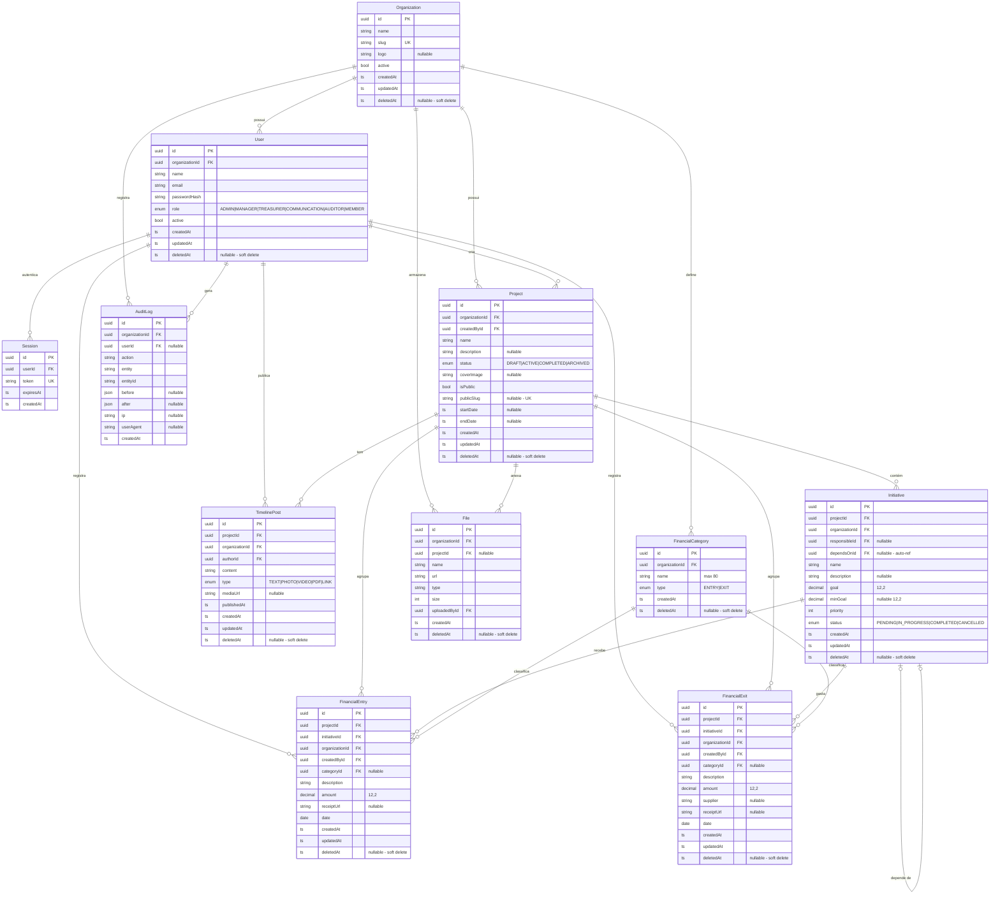

# Diagrama DE-R — gestao_campanha

## Notas

- **Soft delete** em todos os modelos principais via `deletedAt` — registros nunca são removidos fisicamente
- **Tenant isolation** — todas as queries filtram por `organizationId`
- **`Initiative.raised`** não existe como campo — é calculado via `SUM(FinancialEntry.amount)` em tempo de consulta
- **`FinancialCategory`** é org-level (não por projeto), com tipo `ENTRY` ou `EXIT`
- **`FinancialEntry` e `FinancialExit`** pertencem obrigatoriamente a uma `Initiative` e opcionalmente a uma `FinancialCategory`
- **`Initiative.dependsOnId`** é auto-referência — uma iniciativa pode depender de outra do mesmo projeto
